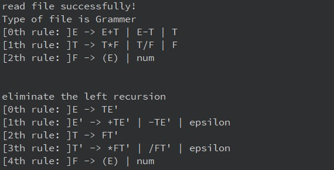

# Parser
> **Pipeline**


> **grammar Defination**
>>*context-free grammar* \
G[s] := <V<sub>N</sub>, V<sub>T</sub>, P, S>

>>V<sub>N</sub> = {} \
V<sub>T</sub> = {} \
S = {}


    Cpp Productions::

    <declaration> -> [<declaration_descriptor>]<R1>
    <R1> -> <declaration_notion><R2>|;
    <R2> -> <R5><R4>; | [<declaration_list>]<composition_sentence>
    <R4> -> <R3><R4> | epsilon 
    <R5> -> ,<declaration_init>
    <R5> -> =<content_init> | epsilon 

    <declaration_init> -> <declaration_notion><R5>

    <declaration_descriptor> -> <store_type>[<declaration_descriptor>]
                                | <type>[<declaratioin_descriptor>]
                                | <type_constrant>[<declaratioin_descriptor>]
                                | <func>[<declaratioin_descriptor>]
                                | <algin>[<declaratioin_descriptor>]


    <declaration_notion> -> [<pointer>]<direct_declaration>

    <type> -> int | long | char | double | ...

    <direct_declaration> -> <identifier><T4>
                            | ( <declaration_notion> )<T4>

    <T4> -> <T1> | <T5> | epsilon
    <T1> -> <array_declaration> T1 | epsilon
    <T5> -> ( <T5> )
    <T6> -> <params_type_list> | <identifier_list> | epsilon

    <array_declaration> -> [ [type_constrant_list][<copy_expression>] ]

    <params_type_list> -> <param_list><T9>

    <T9> -> , ... | epsilon

    <params_list> -> <params_declaration><T10>
    <T10> -> ,<params_list> | epsilon

    <params_declaration> -> <declaration_descriptor><declaration_notion>


> **We use json to load the grammar of the language** 
>> **V<sub>N</sub>** :: *non_terminals = {}* \
>> **V<sub>T</sub>** :: *terminals = {}* \
>> **S** :: *start_symbols = {}* \
>> **productions** ={
>>          <p>&emsp; &emsp;*{ E -> E + T | E - T | T }*, \
>> &emsp; &emsp;            *{ T -> T * F | T / F | F }*, \
>> &emsp; &emsp;            *{ F -> ( E ) | num }*</p>
    }  

> ***grammar.json***
```json
{
    "Type": "Grammar",
    "non_terminals": "E T F",
    "terminals": "+ - * / ( ) num",
    "start_symbol": "E",
    "productions": [
        {
            "left": "E",
            "candidate": [
                "E+T",
                "E-T",
                "T"
            ]
        },
        {
            "left": "T",
            "candidate":[
                "T*F",
                "T/F",
                "F"
            ]
        },
        {
            "left": "F",
            "candidate": [
                "(E)",
                "num"
            ]
        }
    ]
}
```

> ***Eliminate the left recursion***
> - direct left recursion
> - indirect left recursion
-
    **left recursion** ::
    
    
- 
  **if there exists many productions that include left recursion** \
  we should reorder if and eliminate all the productions contains left recursion 
- **code as follow**
    ```C
    if(grammar.contains("production") &&
            grammar.value("production").isArray()){
            QJsonArray Ps = grammar["production"].toArray();
            for (int i = 0 ; i < Ps.size() ; i++) {
                if(Ps[i].isObject()){
                    QJsonObject rule = Ps[i].toObject();
                    if(rule.contains("left") &&
                            rule.contains("candidate") &&
                            rule["left"].isString() &&
                            rule["candidate"].isArray()){
                        cout << "[" << i <<"th rule: ]" << rule["left"].toString().toStdString() << " -> ";
                        QString leftStr = rule["left"].toString();
                        QJsonArray candidates = rule["candidate"].toArray();
                        QString leftExtendStr = leftStr+"'";

                        MyQString left;
                        left.leftStr = leftStr;

                        MyQString leftExtend;
                        leftExtend.leftStr = leftExtendStr;
                        productions[left] = {};
                        for (int j = 0 ; j < candidates.size() ; j++ ) {
                            if(j>0){
                                cout<<" | ";
                            }
                            cout<<candidates[j].toString().toStdString();
                            if(candidates[j].toString().indexOf(leftStr) != 0){//没有左递归的表达式，利用βA' 放入容器当中
                                if(non_terminals.contains(leftExtendStr)){
                                    QString betaExtend = candidates[j].toString() + leftExtendStr;
                                    productions[left].push_back(betaExtend);
                                }
                                else{
                                    QString tmp = candidates[j].toString();
                                    productions[left].push_back(tmp);
                                }
                            }
                            else{//该候选式含有左递归
                                QVector<QString>::iterator iter=find(non_terminals.begin(),non_terminals.end(), leftExtendStr);
                                if(iter == non_terminals.end()){
                                    non_terminals.push_back(leftExtendStr);
                                }
                                if(non_terminals.contains(leftExtendStr)){//已经拓展了符号
                                    QString alpha = candidates[j].toString().mid(1);
                                    alpha+=leftExtendStr;
                                    productions[leftExtend].push_back(alpha);
                                }
                            }
                        }
                        QVector<QString>::iterator iter=find(non_terminals.begin(),non_terminals.end(), leftExtendStr);
                        if(iter != non_terminals.end()){
                            productions[leftExtend].push_back("epsilon");
                        }
                        cout<<endl;
                    }
                }
            }
    }
    ```

> ***Extract the left common factor***

***Use Tire tree to find the left common factor of the Grammar***
- **code as follow**
    ```C++
    for(auto iter = productions.begin(); iter != productions.end(); iter++){
            Tire tire;
            QVector<QString> candidates = iter.value();
            for(int i = 0; i < candidates.size(); i++){
                tire.insert(candidates[i]);
            }
            QVector<QString> common_left;
            tire.searchLeftCommonFactor(tire.getRoot(), common_left, "");
            // new non_terminals
            // new productions
            QSet<QString> newproductions;
            bool* inMatch = (bool*)malloc(sizeof(bool) * (candidates.size()+1));
            for(int j = 0 ; j < candidates.size() ; j++){
                inMatch[j] = false;
            }
            for (int j = 0 ; j < common_left.size() ; j++) {
            std::string num = std::to_string(j);
            QString VN = iter.key().leftStr;
            VN += QString::fromStdString(num);
            non_terminals.push_back(VN);

            for(int k = 0 ; k < candidates.size() ; k++){
                if(!inMatch[k]){
                    inMatch[k] = candidates[k].indexOf(common_left[j]) == 0 ? true : false;
                    if(inMatch[k]){
                        MyQString newVN;
                        newVN.leftStr = VN;
                        if(candidates[k].length() == common_left[j].length())
                            productions[newVN].push_back("epsilon");//是否有epsilon
                        else{
                            productions[newVN].push_back(candidates[k].mid(common_left[j].length()));
                        }
                        candidates[k] = common_left[j] + VN;
                        newproductions.insert(candidates[k]);
                    }
                }
            }
            }
            QVector<QString> updatePro;
            for (auto it = newproductions.begin(); it != newproductions.end(); it++ ){
                updatePro.push_back(QString::fromStdString(it->toStdString()));
            }
            productions[iter.key()] = updatePro;
        }
    ```


> ***first Set***

<!-- $$ If\space X \in V_T, first(X) = {X}$$
$$ If\space X \in V_N, X\rightarrow a (a \in V_T \vee a = \epsilon),\space first(X) = first(X) \cup \{a\} $$
$$ If\space X \rightarrow Y_1 Y_2 ... Y_k Y_{k+1}...\space , \epsilon \in 
first(Y_i) (i = 1,...,k),\space first(X) = first(X) \cap \{ a \in first(Y_i) | a \not ={\epsilon} \}$$ -->
- code as follow
```C++
    void calculate_first(MyQString left){
        MyQString eps;
        eps.leftStr = "epsilon";
        bool all_has_epsilon(true);
        QVector<QString> candidates = productions[left];
        for(int i = 0 ; i < candidates.size() ; i++){
            for (int j = 0 ; j < candidates[i].length() ; j++) {
                MyQString tmp = candidates[i].mid(j, 1);
                if(V_T.contains(tmp)){//是终结符
                    first[left].insert(tmp);
                    break;
                }
                if(!constructed[tmp]){
                    calculate_first(tmp);
                }
                if(!first[tmp].contains(eps)){
                    all_has_epsilon = false;
                    break;
                }else{
                    //去掉epsilon
                    first[tmp].remove(eps);
                }
            }
            if(all_has_epsilon){
                first[candidates[i]].insert(eps);
            }
            for(auto iter = first[candidates[i]].begin(); iter != first[candidates[i]].end() ; iter++){
                first[left].insert(*iter);
            }
        }
        constructed[left] = true;
    }

```

> ***follow Set***
<!-- $$If\space X \in Start\_symbols\space ,follow(X) = follow(X) \cup \{ \$ \} $$
$$If\space \exists \space A\rightarrow \alpha B\beta\space $$
$$If\space \beta {\Rightarrow}^* \epsilon$$
$$ follow(A) \subset follow(B)$$
$$ Else\space if\space \beta {\nRightarrow} \epsilon $$
$$ first(\beta) \subset follow(B) $$  -->

two $V_N$'s follow set may be contains each other, so the recursion programme may be nonterminable
We notice that 
<!-- $$ follow(A) \subset follow(B) \wedge follow(B) \subset follow(A) \Leftrightarrow follow(A) = follow(B)  $$ -->

- code as follow
```C++
    void calculate_follow(MyQString left){
        MyQString eps;
        eps.leftStr = "epsilon";
        for (auto iter = productions.begin(); iter != productions.end() ; iter++) {
            QVector<QString> candidates = iter.value();
            for(int i = 0 ; i < candidates.size() ; i++){
                int index = 0 ;
                index = candidates[i].indexOf(left.leftStr);
                for(int j = index + 1; j < candidates[i].size() ; j++){
                    QString next = candidates[i].mid(index+1,1);
                    if(V_T.contains(next)){
                        follow[left].insert(next);
                        break;
                    }
                    for (auto iter = first[next].begin() ; iter != first[next].end() ; iter++){
                        follow[left].insert(*iter);
                    }
                    if(!first[next].contains(eps)){
                        break;
                    }else{
                        follow[left].remove(eps);
                    }
                }
                // A->αB | β->epsilon
                if(iter.key().leftStr != left.leftStr && candidates[i].length() == index){
                    follow_contains[left][iter.key()] = true;
                    if(!follow_contains[iter.key()][left]){
                        if(!follow_constructed[iter.key()]){
                            calculate_follow(iter.key());
                        }
                        for(auto ir = follow[iter.key()].begin(); ir != follow[iter.key()].end() ; ir++){
                            follow[left].insert(*ir);
                        }

                    }
                    else{
                        follow[left] = follow[iter.key()];
                    }
                }
            }
        }
        follow_constructed[left] = true;
    }

```

> ***LL(1) Table***
>>
|        LL(1)         |       terminals    |
|       :----:         |        :----:      |
|      non_terminals   |      productions   |


> ***Non-recursive predictive analysis*** \
>> Use a Symbol Stack which has $ and start_symbol at first
```
    +-------+
    |   S   |
    +-------+
    |   $   |
    +-------+               input string abcd...xyz

```
find [S,a] in LL(1) Table to get the production going to be used


> ***Abstract Syntax Tree***
>> use graphviz 2.x to visualize a AST